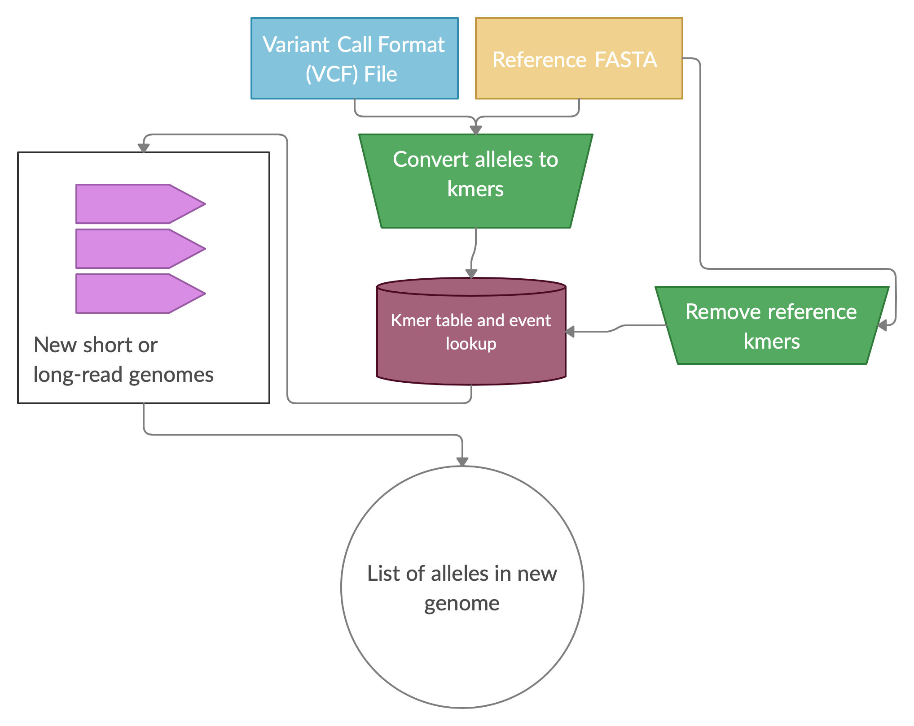

# NibblerSV

## Intro statement
Structural variation (SV) are the largest source of genetic variation within the human population. Long read DNA sequencing is becoming the preferred method for discovering structural variants. Structural variation can be longer than a short-read (<500bp) DNA trace, meaning the SV allele is not contained, which causes challenges and problems in the detection.

Long read sequencing has proven superior to identify Structural Variations in individuals. Nevertheless, it is important to obtain accurate allele frequencies of these complex alleles across a population to rank and identify potential pathogenic variations.  Thus, it is important to be able to genotype SV events in a large set of previously short read based sequenced samples (e.g. 1000genomes, Topmed, CCDG, etc.).  Two main approaches has been recently shown to achieve this with high accuracy even for insertions: Paragraph and VG. However, these methods still consume hours per sample and even more depending on the number of SV to be genotyped along the genome or in regions. Furthermore and maybe more crucially rely on precise breakpoints that do not change in other samples. This assumption might be flawed over repetitive regions.  In addition the problem currently arises that some data sets are mapped to different genomic version than others (e.g hg19 vs. GRCH38 vs. CHM13) and will require a different VCF catalog to be genotyped.  

# Why NibblerSV
NibblerSV can overcome these challenges. NibblerSV relies on a k-mer based strategy to identify SV breakpoints in short read data set. Due to innovative k-mer design and efficient implementation, NibblerSV is able to run on a 30x cram file within minutes with low memory requirements. Its k-mer strategy of spaced k-mers allow a relaxed constrain on the precision of the breakpoint. In addition, utilizing k-mers NibblerSV is independent of the genomic reference the short reads were aligned to and can even work on raw fastq reads. This makes NibblerSV a lightweight, scalable and easy to apply methods to identify the frequency of Structural Variatons. 


Who doesn't like to nibble on SV?
# What is <this software>?
NibblerSV is a light weighted framework to identify the presence and absence of Structural Variations across a large set of Illumina sequenced samples. To achieve this we take a VCF file including all the SV that should be genotyped. Next, we extract the reference and alternative allele kmers. This is done such that we include the flanking regions. Subsequently, we count the occurrence of these k-mers in the reference fasta file. This is necessary to not miscount certain k-mers. To enable large scaling of NibblerSV the results of these two steps are written into a temporary file, which is all that is needed for the actual genotyping step. 

During the genotyping step NibblerSV uses the small temporary file  and the bam/cram file of the sample. NibblerSV then identifies the presence /absence of the reference and alternative k-mer across the entire sample. This is very fast and requires only minimal resources of memory as the number of k-mers is limited. Once NibblerSV finished the scanning of the bam/cram file it reports out which SV have been re-identified by adding a tag in the output VCF file of this sample. The VCF per sample can then be merged to obtain population frequencies. 



# How to use <this software>

# Software Workflow Diagram
Rough workflow  (Eric D):

1. Parse a SV VCF file
   Reconstitute alleles (adding flank to deletions and insertions)
   Build map/hash/set/vector of kmers that are present in SVs (SVnibs)
2. Parse human reference genome generating another set of kmers (Brent)
3. Remove SVnibs that are in the human reference genome. We cannot quickly type those SVs that are reference derived. This will remove many of the insertions: Alu’s lines ect.
4. Type. In this stage we will go through novel/new genomes and see if they contain the SVnibs. Account for frequency, and depth.

How to make this rapid?

Update VCF?

# File structure diagram
## Input
1. A Strucutural variant VCF
2. An indexed FASTA file of the reference genome
3. A BAM/CRAM file (new genome)

**important** : Reference genome needs to match VCF

#### _Define paths, variable names, etc_

# Installation options:

We provide two options for installing <this software>: Docker or directly from Github.

### Docker

The Docker image contains <this software> as well as a webserver and FTP server in case you want to deploy the FTP server. It does also contain a web server for testing the <this software> main website (but should only be used for debug purposes).

1. `docker pull ncbihackathons/<this software>` command to pull the image from the DockerHub
2. `docker run ncbihackathons/<this software>` Run the docker image from the master shell script
3. Edit the configuration files as below

### Installing <this software> from Github

1. `git clone https://github.com/NCBI-Hackathons/<this software>.git`
2. Edit the configuration files as below
3. `sh server/<this software>.sh` to test
4. Add cron job as required (to execute <this software>.sh script)

### Configuration

```Examples here```

# Testing

We tested four different tools with <this software>. They can be found in [server/tools/](server/tools/) .

# Additional Functionality

### DockerFile

<this software> comes with a Dockerfile which can be used to build the Docker image.

  1. `git clone https://github.com/NCBI-Hackathons/<this software>.git`
  2. `cd server`
  3. `docker build --rm -t <this software>/<this software> .`
  4. `docker run -t -i <this software>/<this software>`

### Website

There is also a Docker image for hosting the main website. This should only be used for debug purposes.

  1. `git clone https://github.com/NCBI-Hackathons/<this software>.git`
  2. `cd Website`
  3. `docker build --rm -t <this software>/website .`
  4. `docker run -t -i <this software>/website`
